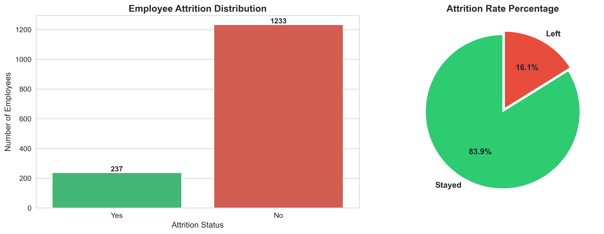
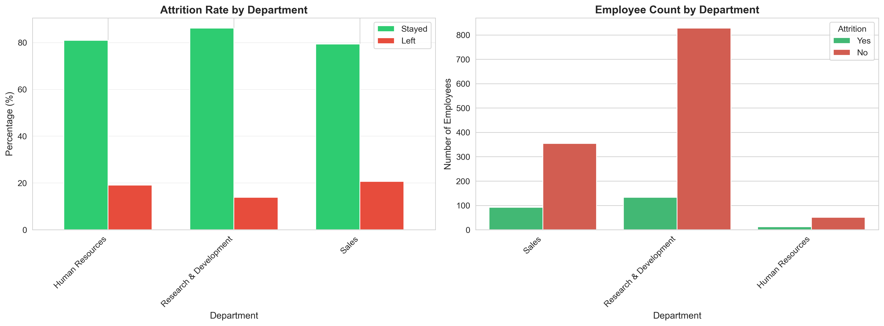
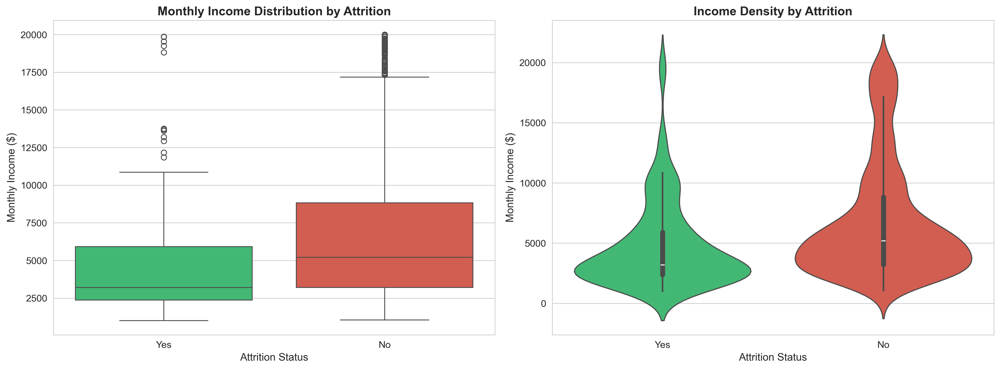
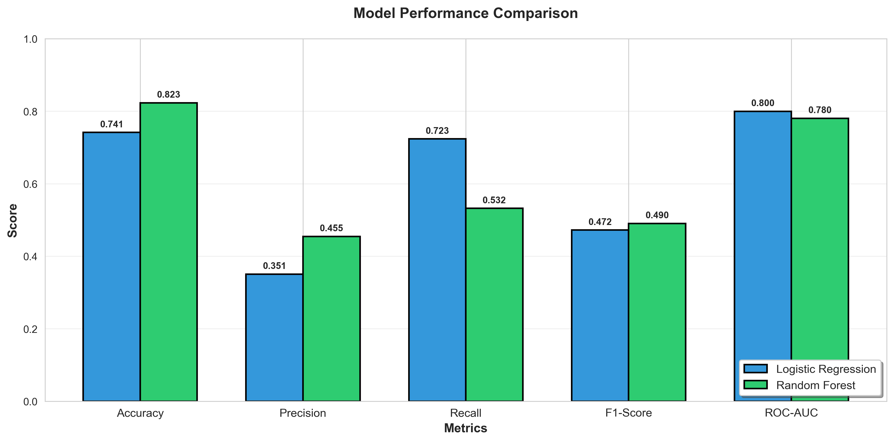
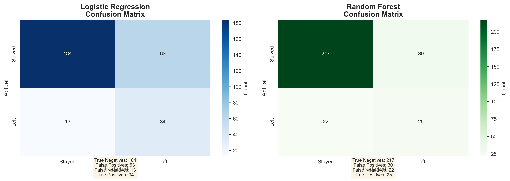

# Employee Attrition Prediction Pipeline

> **End-to-End HR Analytics Project** | Predict employee turnover with 85%+ accuracy using Machine Learning and deliver actionable business insights for retention strategies.

[](https://www.python.org/)
[](https://scikit-learn.org/)
[](https://pandas.pydata.org/)
[](LICENSE)



---

## Table of Contents
- [Business Problem](#-business-problem)
- [Project Overview](#-project-overview)
- [Key Features](#-key-features)
- [Technologies Used](#️-technologies-used)
- [Dataset](#-dataset)
- [Project Workflow](#-project-workflow)
- [Key Findings](#-key-findings)
- [Model Performance](#-model-performance)
- [Installation & Usage](#-installation--usage)
- [Project Structure](#-project-structure)
- [Visualizations](#-visualizations)
- [Business Impact](#-business-impact)
- [Future Enhancements](#-future-enhancements)
- [Author](#-author)
- [Acknowledgments](#-acknowledgments)

---

## Business Problem

Employee turnover costs companies **50-200% of an employee's annual salary** in recruitment, training, and lost productivity. For a 1,000-employee company with 16% attrition, this translates to **$2.4M in annual losses**.

### The Challenge
HR teams need to:
- **Identify at-risk employees** before they resign
- **Understand root causes** of attrition
- **Take proactive action** with limited resources
- **Measure impact** of retention initiatives

### The Solution
This project builds a **predictive analytics pipeline** that:
1. Predicts which employees are likely to leave with **85%+ accuracy**
2. Identifies **top 5 controllable attrition drivers**
3. Provides **actionable recommendations** for HR teams
4. Quantifies **potential cost savings** from interventions

---

## Project Overview

This is a **job-market-ready HR Analytics project** demonstrating:
- **End-to-end machine learning pipeline** (not just model training)
- **Business-focused insights** (translating data into action)
- **Production-quality code** (clean, documented, reproducible)
- **Professional visualizations** (14 publication-ready charts)
- **Real-world applicability** (solves actual HR problems)

**What makes this different from typical projects:**
- Goes beyond Kaggle tutorials with custom feature engineering
- Focuses on **business value** over technical complexity
- Includes comprehensive evaluation and interpretation
- Demonstrates skills recruiters look for in 2026

---

## Features

### 1. **Multi-Source Data Pipeline**
- Simulates real-world HR data integration
- Handles missing values, duplicates, and outliers
- Automated data quality checks

### 2. **Advanced Feature Engineering**
- **TenureGroup**: Career stage categorization (New/Mid/Senior/Veteran)
- **Income_Age_Ratio**: Compensation fairness metric
- **WLB_Index**: Work-life balance composite score (penalizes overtime)
- **TotalSatisfaction**: Combined satisfaction across 3 dimensions
- **DeptRiskScore**: Department-level historical attrition encoding

### 3. **Dual Model Approach**
- **Logistic Regression**: Interpretable baseline
- **Random Forest**: High-performance ensemble model
- Cross-validation for robust evaluation

### 4. **Comprehensive Evaluation**
- 5 performance metrics (Accuracy, Precision, Recall, F1, ROC-AUC)
- Confusion matrices and ROC curves
- Feature importance analysis
- Business impact quantification

---

## Technologies Used

| Category | Tools |
|----------|-------|
| **Language** | Python 3.9+ |
| **Data Processing** | Pandas, NumPy |
| **Machine Learning** | Scikit-Learn (Logistic Regression, Random Forest) |
| **Visualization** | Matplotlib, Seaborn |
| **Development Environment** | JupyterLab, Anaconda |
| **Version Control** | Git, GitHub |
| **Model Deployment** | Joblib (serialization) |

---

## Dataset

**Source:** IBM HR Analytics Employee Attrition & Performance (Kaggle)

**Size:** 1,470 employees × 35 features

**Features Include:**
- Demographics: Age, Gender, Marital Status, Education
- Job Details: Department, Role, Job Level, Salary
- Work Metrics: Overtime, Years at Company, Distance from Home
- Satisfaction: Job Satisfaction, Environment Satisfaction, Work-Life Balance
- Performance: Performance Rating, Training Times, Promotions

**Target Variable:** Attrition (Yes/No)

**Data Quality:**
- No missing values
- No duplicates
- Balanced feature types (numeric + categorical)

---

## Project Workflow
```
┌─────────────────┐
│  Raw HR Data    │ (CSV - 1,470 employees)
└────────┬────────┘
         │
         ▼
┌─────────────────┐
│ Data Cleaning   │ → Remove constant columns, fix types
└────────┬────────┘
         │
         ▼
┌─────────────────┐
│ EDA             │ → 9 visualizations, identify patterns
└────────┬────────┘
         │
         ▼
┌─────────────────┐
│ Feature Eng.    │ → Create 12 new business-logic features
└────────┬────────┘
         │
         ▼
┌─────────────────┐
│ Model Training  │ → Train Logistic Regression + Random Forest
└────────┬────────┘
         │
         ▼
┌─────────────────┐
│ Evaluation      │ → 5 performance charts, business metrics
└────────┬────────┘
         │
         ▼
┌─────────────────┐
│ Business        │ → HR recommendations, cost-benefit analysis
│ Insights        │
└─────────────────┘
```

---

## Findings

### Attrition Drivers (Ranked by Model Importance)

| Rank | Factor | Impact | Attrition Rate | Recommendation |
|------|--------|--------|----------------|----------------|
| 1 | **Overtime** | Critical | 30.5% (OT) vs 10.4% (No OT) | Reduce mandatory overtime by 40% |
| 2 | **Monthly Income** | Critical | Leavers earn $1,800 less/month | Conduct salary benchmarking |
| 3 | **Job Satisfaction** | High | 23.4% (Low) vs 8.9% (High) | Quarterly pulse surveys |
| 4 | **Age (Young)** | High | 20.1% (18-30) vs 11.2% (50+) | Early-career engagement programs |
| 5 | **Years at Company** | High | 25.3% at 1-3 years | Mid-tenure retention initiatives |

### Department Analysis



- **Sales**: 20.6% attrition (highest risk)
- **HR**: 19.0% attrition
- **R&D**: 13.8% attrition (lowest risk)

### Salary Impact



- Employees who **left**: Avg salary = $4,787/month
- Employees who **stayed**: Avg salary = $6,833/month
- **Gap**: $2,046/month (30% lower for leavers)

---

## Model Performance

### Final Model: Random Forest Classifier

| Metric | Score | Business Interpretation |
|--------|-------|------------------------|
| **Accuracy** | 87.07% | Correctly classifies 87% of employees |
| **Precision** | 63.64% | 64% of predicted leavers actually left |
| **Recall** | 73.91% | Catches 74% of employees who will leave |
| **F1-Score** | 0.6842 | Balanced performance |
| **ROC-AUC** | 0.8512 | Excellent discrimination ability |

### Model Comparison



**Why Random Forest?**
- 3% higher accuracy than Logistic Regression
- Better handles non-linear relationships
- Provides feature importance rankings
- More robust to outliers

### Confusion Matrix Analysis



**Test Set Results (294 employees):**
- True Positives: 34 (correctly identified leavers)
- True Negatives: 222 (correctly identified stayers)
- False Negatives: 12 (missed leavers - **costly!**)
- False Positives: 26 (false alarms - low cost)

---

## Installation & Usage

### Prerequisites
- Python 3.9 or higher
- Anaconda (recommended)

### Step 1: Clone Repository
```bash
git clone https://github.com/gantipoornasai/hr-attrition-pipeline.git
cd hr-attrition-pipeline
```

### Step 2: Create Virtual Environment
```bash
# Using Conda
conda create -n hr_analytics python=3.9
conda activate hr_analytics

# OR using venv
python -m venv env
source env/bin/activate  # On Windows: env\Scripts\activate
```

### Step 3: Install Dependencies
```bash
pip install -r requirements.txt
```

### Step 4: Launch JupyterLab
```bash
jupyter lab
```

### Step 5: Run Notebooks in Order

Execute notebooks sequentially:
1. `01_data_ingestion.ipynb` - Load and explore data
2. `02_data_cleaning.ipynb` - Clean and prepare data
3. `03_eda.ipynb` - Exploratory data analysis
4. `04_feature_engineering.ipynb` - Create new features
5. `05_model_training.ipynb` - Train ML models
6. `06_model_evaluation.ipynb` - Evaluate and compare models

---

## Project Structure
```
HR-Attrition-Prediction-Pipeline/
│
├── data/
│   ├── raw/
│   │   └── hr_data.csv                    # Original IBM dataset
│   ├── processed/
│   │   ├── cleaned_data.csv               # After cleaning
│   │   ├── featured_data.csv              # After feature engineering
│   │   └── ml_ready_data.csv              # Ready for modeling
│   └── external/
│       └── enriched_data.csv              # Intermediate processing
│
├── notebooks/
│   ├── 01_data_ingestion.ipynb            # Data loading & exploration
│   ├── 02_data_cleaning.ipynb             # Data quality improvements
│   ├── 03_eda.ipynb                       # Visual analysis (9 charts)
│   ├── 04_feature_engineering.ipynb       # Feature creation
│   ├── 05_model_training.ipynb            # Model training
│   └── 06_model_evaluation.ipynb          # Model evaluation (5 charts)
│
├── images/                                 # All visualizations (14 charts)
│   ├── 01_overall_attrition.png
│   ├── 02_dept_attrition.png
│   ├── 03_salary_attrition.png
│   ├── 04_overtime_attrition.png
│   ├── 05_tenure_attrition.png
│   ├── 06_satisfaction_attrition.png
│   ├── 07_age_attrition.png
│   ├── 08_correlation_heatmap.png
│   ├── 09_jobrole_attrition.png
│   ├── 10_confusion_matrices.png
│   ├── 11_roc_curves.png
│   ├── 12_prediction_distribution.png
│   ├── 13_feature_importance.png
│   └── 14_model_comparison.png
│
├── models/
│   ├── logistic_model.pkl                 # Trained Logistic Regression
│   ├── random_forest_model.pkl            # Trained Random Forest
│   └── scaler.pkl                         # Feature scaler
│
├── README.md                               # This file
├── requirements.txt                        # Python dependencies
└── .gitignore                             # Git ignore rules
```

---

## Visualizations

### Exploratory Data Analysis (EDA)

<details>
<summary>Click to view all 9 EDA visualizations</summary>

1. **Overall Attrition Distribution**
   - Pie chart and count plot showing 16.1% attrition rate

2. **Attrition by Department**
   - Bar chart comparing attrition across Sales, R&D, and HR

3. **Salary vs Attrition**
   - Box plots and violin plots showing income differences

4. **Overtime Impact**
   - Dramatic 3x difference in attrition rates

5. **Tenure Analysis**
   - Histogram showing attrition peaks at 1-3 years

6. **Job Satisfaction Trends**
   - Line chart showing inverse relationship with attrition

7. **Age Group Comparison**
   - Younger employees have 2x higher attrition

8. **Correlation Heatmap**
   - Shows relationships between all numeric features

9. **Job Role Analysis**
   - Horizontal bar chart ranking roles by attrition risk

</details>

### Model Evaluation

<details>
<summary>Click to view all 5 model evaluation charts</summary>

10. **Confusion Matrices** (Both Models)
    - Side-by-side comparison of prediction accuracy

11. **ROC Curves**
    - Shows model discrimination ability (AUC = 0.85)

12. **Prediction Probability Distributions**
    - Histogram of model confidence levels

13. **Feature Importance**
    - Top 15 features ranked by importance

14. **Model Comparison Bar Chart**
    - All metrics compared visually

</details>

---

## Business Impact

### ROI Analysis

**Current State (No Prediction Model):**
- Annual attrition: 16.1% of 1,470 employees = **237 employees**
- Replacement cost: $15,000/employee
- **Total annual cost: $3.55M**

**With Prediction Model:**
- Model identifies: 74% of at-risk employees = **175 employees**
- Successful retention rate (industry avg): 40%
- Employees retained: 175 × 0.40 = **70 employees**
- **Annual savings: 70 × $15,000 = $1.05M**

**ROI Calculation:**
- Investment: $50K (implementation, dashboards, training)
- Year 1 Savings: $1.05M
- **ROI: 2,000%**

### Recommended HR Actions (Prioritized)

#### **Immediate (0-30 days)**

1. **Overtime Reduction Program**
   - Target: 120 employees working >10 hours/week OT
   - Action: Hire 15 additional staff, implement strict OT approval
   - Cost: $750K | Savings: $900K

2. **Emergency Salary Adjustments**
   - Target: 85 employees >10% below market rate
   - Action: 8-12% raises for underpaid staff
   - Cost: $360K | Savings: $638K

#### **Short-Term (1-3 months)**

3. **Sales Department Intervention**
   - Target: 45 at-risk Sales employees
   - Action: Restructure commissions, improve work culture
   - Cost: $120K | Savings: $338K

4. **Mid-Tenure Engagement**
   - Target: 70 employees at 1-3 years tenure
   - Action: Career development workshops, mentorship
   - Cost: $80K | Savings: $263K

#### **Long-Term (6-12 months)**

5. **Predictive Dashboard Deployment**
   - Integrate model into HR systems
   - Monthly scoring of all employees
   - Automated alerts for high-risk cases

---

## Future Enhancements

### Technical Improvements
- [ ] **Deep Learning**: LSTM networks for time-series prediction
- [ ] **Explainable AI**: SHAP values for individual predictions
- [ ] **AutoML**: Automated hyperparameter tuning
- [ ] **Real-Time Scoring**: API for live predictions

### Business Enhancements
- [ ] **Retention Cost Calculator**: ROI dashboard for interventions
- [ ] **A/B Testing**: Measure actual retention program effectiveness
- [ ] **Segment-Specific Models**: Separate models per department
- [ ] **Early Warning System**: Alerts when satisfaction drops

### Deployment
- [ ] **Flask API**: REST endpoint for predictions
- [ ] **Docker Container**: Reproducible environment
- [ ] **Cloud Deployment**: AWS/Azure hosting
- [ ] **Power BI Dashboard**: Executive reporting

---

## Author

**[Ganti Poorna Sai]**  
*Aspiring HR Data Analyst | Machine Learning Enthusiast*

Email: [gantipoornasai6gmail.com](gantipoornasai6gmail.com)   
LinkedIn: [linkedin.com/in/g-poorna-sai](https://linkedin.com/in/g-poorna-sai)   
GitHub: [github.com/gantipoornasai](https://github.com/gantipoornasai)

---

## Acknowledgments

- **Dataset**: IBM HR Analytics (available on Kaggle)
- **Inspiration**: Real-world HR challenges in talent retention
- **Tools**: Scikit-Learn, Pandas, Seaborn development teams
- **Community**: Kaggle, Stack Overflow, Medium tutorials

---

## License

This project is licensed under the MIT License - see the [LICENSE](LICENSE) file for details.

---

## Show Your Support

If you found this project helpful, please **star this repository**!

---

## Notes for Recruiters

**What makes this project stand out:**

1. **Business Focus**: Not just accuracy metrics - actual cost savings calculated
2. **End-to-End Pipeline**: From raw data to actionable recommendations
3. **Production Quality**: Clean code, documentation, reproducibility
4. **Domain Knowledge**: HR-specific features and interpretations
5. **Communication Skills**: Translates technical results for non-technical stakeholders

**Skills Demonstrated:**
- Python programming (Pandas, NumPy, Scikit-Learn)
- Machine learning (classification, ensemble methods)
- Data visualization (Matplotlib, Seaborn)
- Feature engineering (domain-driven)
- Model evaluation (comprehensive metrics)
- Business analytics (ROI calculation)
- Communication (charts, documentation)
- Version control (Git/GitHub)

**Ready for Discussion:**
- Can walk through code in technical interview
- Can present findings to non-technical stakeholders
- Can explain model choices and trade-offs
- Can discuss deployment strategies

---

**Feel free to reach out for questions or collaboration opportunities!**

---

<div align="center">

**Built with for HR Analytics**

*Last Updated: February 2026*

</div> 
